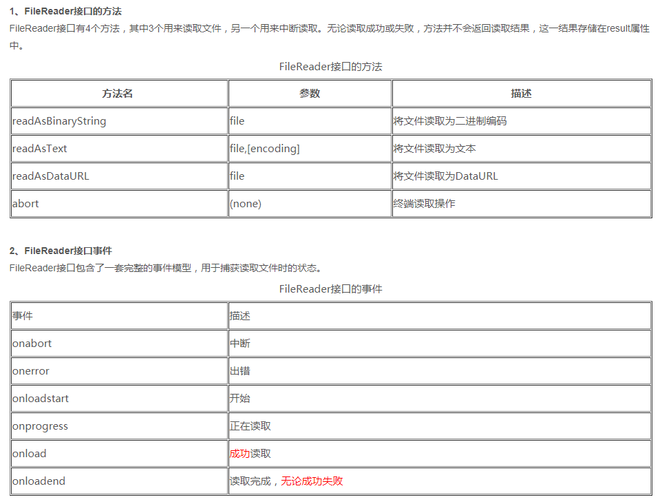

### FileReader
Data URL协议：提供一种将图片嵌入到HTML中的方法。图片转换成base64编码的字符串存在，存储在URL中。

Base64是一种任意二进制到文本字符串的编码方法，常用于在URL、Cookie、网页中传输少量二进制数据。

用记事本打开exe、jpg、pdf这些文件时，我们都会看到一大堆乱码，因为二进制文件包含很多无法显示和打印的字符，所以，如果要让记事本这样的文本处理软件能处理二进制数据，就需要一个二进制到字符串的转换方法。Base64是一种最常见的二进制编码方法。

