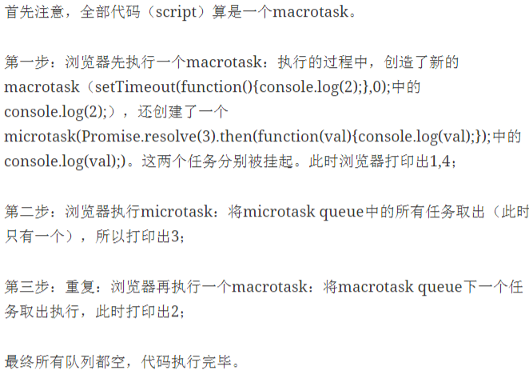

### eventloop简介

[好文](https://segmentfault.com/a/1190000004322358)
直接上图。简单粗暴。

eventloop的意思是事件循环，因为是事件驱动，然后触发事件后产生消息，这里消息指的就是发起异步任务时的回调函数，将消息放到消息队列，然后在主线程执行完当前执行栈的所有同步代码后，就会到消息队列取出这条消息并消费，也就是执行回调函数。

<pre>
setImmediate(() => {
    console.log(2);
});
setTimeout(() => {
    console.log(3);
}, 0);
process.nextTick(() => {
    console.log(4);
});
console.log(1);
// 1432
</pre>
解释：

nextTick(callback)是将callback插入消息队列的队首，如果当前有消息正在处理，就会等处理完立刻执行。

setTimeout(callback,delay[,...args])，在delay时间后产生消息，并不一定会在这时间后就执行，因为有主线程的费时任务或nextTick的存在。

setImmediate(callback[,...args])，callback将在所有io事件处理完毕后执行，多次使用会按顺序执行。

所以setimmediate是最后一个，nexttick插队操作是第一个。

不过，如果delay延时时间长，而主线程和nexttick都执行完了，那么setImmediate就会得到空闲期，就会先执行。

### 正常任务（task）与微任务（microtask）
它们的区别在于，正常任务 在下一轮Event Loop执行，微任务 在本轮Event Loop的所有任务结束后执行
<pre>
console.log(1);

setTimeout(function() {
  console.log(2);
}, 0);

Promise.resolve().then(function() {
  console.log(3);
}).then(function() {
  console.log(4);
});

console.log(5);

// 1
// 5
// 3
// 4
// 2

上面代码的执行结果说明，setTimeout(fn, 0)在Promise.resolve之后执行。

这是因为setTimeout语句指定的是“正常任务”，即不会在当前的Event Loop执行。而Promise会将它的回调函数，在状态改变后的那一轮Event Loop指定为微任务。所以，3和4输出在5之后、2之前。
</pre>

正常任务包括以下情况。

> setTimeout
setInterval
setImmediate
I/O
各种事件（比如鼠标单击事件）的回调函数

微任务目前主要是process.nextTick和 Promise 这两种情况。

*** 

<pre>
setImmediate(function(){
    console.log(1);
},0);
setTimeout(function(){
    console.log(2);
},0);
new Promise(function(resolve){
    console.log(3);
    resolve();
    console.log(4);
}).then(function(){
    console.log(5);
});
console.log(6);
process.nextTick(function(){
    console.log(7);
});
console.log(8);

//3 4 6 8 7 5 2 1

优先级：process.nextTick > promise.then > setTimeout > setImmediate
</pre>
V8实现中，两个队列各包含不同的任务：

macrotasks正常任务: script(整体代码),setTimeout, setInterval, setImmediate, I/O, UI rendering
microtasks微任务: process.nextTick, Promises, Object.observe, MutationObserver

<pre>
setTimeout(function(){console.log(4)},0);
new Promise(function(resolve){
    console.log(1)
    for( var i=0 ; i<10000 ; i++ ){
        i==9999 && resolve()
    }
    console.log(2)
}).then(function(){
    console.log(5)
});
console.log(3);
</pre>

执行过程如下：

> JavaScript引擎首先从macrotask queue中取出第一个任务，
执行完毕后，将microtask queue中的所有任务取出，按顺序全部执行；
然后再从macrotask queue中取下一个，
执行完毕后，再次将microtask queue中的全部取出；
循环往复，直到两个queue中的任务都取完。

解释：
> 代码开始执行时，所有这些代码在macrotask queue中，取出来执行之。
后面遇到了setTimeout，又加入到macrotask queue中，
然后，遇到了promise.then，放入到了另一个队列microtask queue。
等整个execution context stack执行完后，
下一步该取的是microtask queue中的任务了。
因此promise.then的回调比setTimeout先执行。

不管有几个队列，按照优先级从高到底把它们首尾相连，这样就组成了一个“虚拟队列”。(当然，micro在前，macro在后)
事件循环就是不断地从虚拟队列的头中取任务然后执行。在此过程中产生的新任务，会被加到相应的子队列。

之所以一开始要从macro中取一个执行，是因为在最开始的时候，只有macro中有(且只有一个)任务，即全局script，而其他子队列都是空的。

