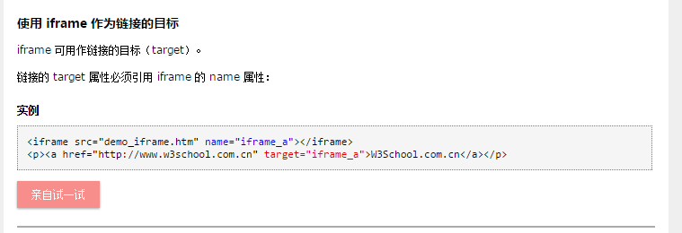

### iframe

target属性表示在什么地方打开，和form中的一样。iframe 用于在网页内显示网页。

如果iframe写了id或者name值，那么这个属性自动成为window的属性。
<pre>
<iframe id="myframe" name="myframe"/>
myframe // HTMLIFrameElement
frames.myframe === myframe  true
</pre>
上面直接使用的myframe获取到的是frame的window对象。
如果是使用dom获取的frame节点，那么还要用frame.contentWindow来获取window对象。
全局环境定义的变量函数自动成为window的属性。所以在frame框架中定义的全局属性可以用frame.function() frame.title。但是前提是父页面和框架页面在同域下。

