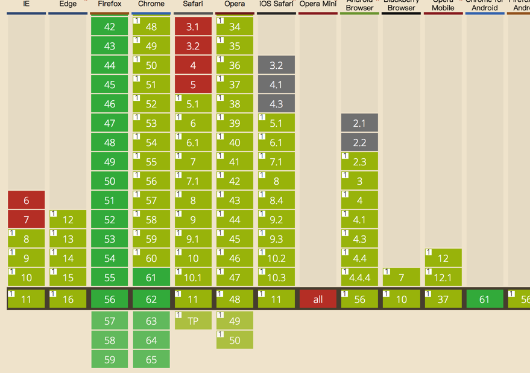

### scrollIntoView

最近看到一些自写的滚动效果，然后想起了scrollInfoView这个api，就又拿出来搞一番。

MDN官方上说这个功能是实验性阶段，不谈移动端，但是看了看caniuse还是一片绿(不喜欢)

主要语法：
<pre>
element.scrollIntoView()//相当于scrollIntoView(true)
element.scrollIntoView(Boolean)//参数为true的话，元素顶端和所在可视区的顶端平齐，
为false的话元素底端和所在可视区的底端对齐
element.scrollIntoView(scrollIntoViewOptions); // Object型参数，可选值有
{
    behavior: "auto"  | "instant" | "smooth",//立即滚动和平滑滚动
    block:    "start" | "end", 不加这个属性的话，滚动位置是在可视区中间。加start的话，就和上一个true效果一样
}
</pre>
效果可以[去这里](./scrollintoview.html)看看

然后，搞事的来了。

### scrollIntoViewIfNeeded
和上面的一样，也是来进行元素滚动的，但是有点小区别，上面的当元素在可视区时，还是会进行指定的滚动，而这个只有元素不在可视区才会进行滚动。不过用法上还是很简单的
<pre>
element.scrollIntoViewIfNeeded()//也是相当于默认传了个true
element.scrollIntoViewIfNeeded(Boolean)//
参数是boolean值，为true的话，元素滚动后的位置在可视区正中；为false的话，就是元素离
可视区上下边缘哪个近，就停在哪个位置，就是说上面的元素要滚下来，最后就停在可视区上
面，下面元素要滚上去，就停在可视区下面
</pre>

卒~
