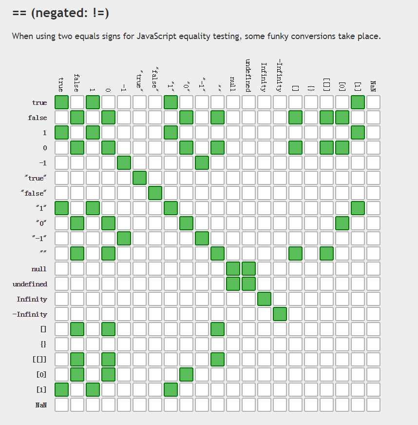

http://dorey.github.io/JavaScript-Equality-Table/

f([ ])这个比较好理解，默认就是true；

下面解释下[ ] == true
[ ] == true => [ ] == ToNumber(true) => [ ] == 1 => ToPrimitive([ ]) == 1 =>ToString([ ]) == 1 => " " == 1 => ToNumber(" ")  == 1 => 0 == 1 => false

[ ] == false 同理

Number()方法对于对象的转换:

 1. 先调用参数的valueOf方法，返回的如果是基本类型的话，就直接调用Number方法
返回时对象的话，进入2
 2. 调用对象的tostring方法，返回的是基本类型，就调Number，是对象的话就报错

String()方法对于对象的转换和上面类似，将两个步骤换一下。 
  
