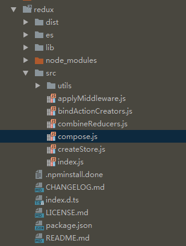

### 部分理解

redux真的是有利于理解函数式编程，遍地都是函数，遍地都很抽象，以下的是部分理解：

先看一眼redux整个文件夹的目录

基本上用到的也都在这几个里面了
先是createstore
<pre>
export var ActionTypes = {
  INIT: '@@redux/INIT'
};

export default function createStore(reducer, preloadedState, enhancer) {
//一整个大的函数，所有的其他函数和变量声明调用都在这个里面，避免全局污染。
  var _ref2;

// enhancer意思是增强，这里就表示增强store，主要作用一般是对store进行封装加工。典型的就是applimiddleware中的使用，将createstore整个方法给传过去，那边就可以获取到这个store。

/*
const store = createStore(
    combineReducers(reducers),
    compose(applyMiddleware(...middlewares))
);
*/

//可以传两个或三个参数，两个参数的话进行重新赋值，保证第三个参数始终是个增强函数
  if (typeof preloadedState === 'function' && typeof enhancer === 'undefined') {
    enhancer = preloadedState;
    preloadedState = undefined;
  }

  if (typeof enhancer !== 'undefined') {
    if (typeof enhancer !== 'function') {
      throw new Error('Expected the enhancer to be a function.');
    }

    return enhancer(createStore)(reducer, preloadedState);
  }

  if (typeof reducer !== 'function') {
    throw new Error('Expected the reducer to be a function.');
  }

  var currentReducer = reducer;
  //如果从外面传的话，就会传到这里，不传或者类型为function的话这里就是UNdefined
  var currentState = preloadedState;
  var currentListeners = [];
  var nextListeners = currentListeners;
  var isDispatching = false;

//这个方法有点疑惑，没理解？？@@
  function ensureCanMutateNextListeners() {
    if (nextListeners === currentListeners) {
      nextListeners = currentListeners.slice();
    }
  }

  function getState() {
    return currentState;
  }

//进行订阅，参数是函数，表示发布的事件发生时的处理，返回值是个函数，直接调用的话就是将这一个listener移除。
  function subscribe(listener) {
    if (typeof listener !== 'function') {
      throw new Error('Expected listener to be a function.');
    }

    var isSubscribed = true;

    ensureCanMutateNextListeners();
    nextListeners.push(listener);

    return function unsubscribe() {
      if (!isSubscribed) {
        return;
      }

      isSubscribed = false;

      ensureCanMutateNextListeners();
      var index = nextListeners.indexOf(listener);
      nextListeners.splice(index, 1);
    };
  }
// 发出action
  function dispatch(action) {
      //action要是简单对象
    if (!isPlainObject(action)) {
      throw new Error('Actions must be plain objects. ' + 'Use custom middleware for async actions.');
    }
    //action必须有个type类型来进行区分，约定。
    if (typeof action.type === 'undefined') {
      throw new Error('Actions may not have an undefined "type" property. ' + 'Have you misspelled a constant?');
    }

    if (isDispatching) {
      throw new Error('Reducers may not dispatch actions.');
    }

    try {
      isDispatching = true;
//currentReducer是由外部传进来的函数，里面是对整个state和发出的action进行处理生成新的state
      currentState = currentReducer(currentState, action);
    } finally {
      isDispatching = false;
    }
//dispatch是同步执行的，执行完通知所有listener执行。
    var listeners = currentListeners = nextListeners;
    for (var i = 0; i < listeners.length; i++) {
      listeners[i]();
    }

    return action;
  }

//替换reducer处理函数，但是没看到有具体的用法。
  function replaceReducer(nextReducer) {
    if (typeof nextReducer !== 'function') {
      throw new Error('Expected the nextReducer to be a function.');
    }

    currentReducer = nextReducer;
    dispatch({ type: ActionTypes.INIT });
  }

  // 这个方法后续研究。
  function observable() {
    var _ref;

    var outerSubscribe = subscribe;
    return _ref = {
      subscribe: function subscribe(observer) {
        if (typeof observer !== 'object') {
          throw new TypeError('Expected the observer to be an object.');
        }

        function observeState() {
          if (observer.next) {
            observer.next(getState());
          }
        }

        observeState();
        var unsubscribe = outerSubscribe(observeState);
        return { unsubscribe: unsubscribe };
      }
    }, _ref[$$observable] = function () {
      return this;
    }, _ref;
  }
//初始化一个action
  dispatch({ type: ActionTypes.INIT });

  return _ref2 = {
    dispatch: dispatch,
    subscribe: subscribe,
    getState: getState,
    replaceReducer: replaceReducer
  }, _ref2[$$observable] = observable, _ref2;
}
</pre>

***

上面有个currentReducer函数，表示的是一个reducer函数，当然，如果是直接传一个reducer函数进来的话，返回一个state，那么这个store只有这一个state，getstate方法返回的也是这个值；如果是多个reducer函数进行组合的话，返回的就是一个大的state树，正常来讲都是用combineReducer来进行多个state的组合，下面上它:
<pre>
//reducer可用性判断
function assertReducerSanity(reducers) {
  Object.keys(reducers).forEach(function (key) {
    var reducer = reducers[key];
    var initialState = reducer(undefined, { type: ActionTypes.INIT });
//reducer函数要给一个初始状态，不能是undefined
    if (typeof initialState === 'undefined') {
      throw new Error('Reducer "' + key + '" returned undefined during initialization. ' + 'If the state passed to the reducer is undefined, you must ' + 'explicitly return the initial state. The initial state may ' + 'not be undefined.');
    }
//tostring(36)是36进制，这里感觉是和上面的功能一样，不过type是个随机的@@
    var type = '@@redux/PROBE_UNKNOWN_ACTION_' + Math.random().toString(36).substring(7).split('').join('.');
    if (typeof reducer(undefined, { type: type }) === 'undefined') {
      throw new Error('Reducer "' + key + '" returned undefined when probed with a random type. ' + ('Don\'t try to handle ' + ActionTypes.INIT + ' or other actions in "redux/*" ') + 'namespace. They are considered private. Instead, you must return the ' + 'current state for any unknown actions, unless it is undefined, ' + 'in which case you must return the initial state, regardless of the ' + 'action type. The initial state may not be undefined.');
    }
  });
}

//新旧state进行比较判断
function getUnexpectedStateShapeWarningMessage(inputState, reducers, action, unexpectedKeyCache) {
  var reducerKeys = Object.keys(reducers);
  var argumentName = action && action.type === ActionTypes.INIT ? 'preloadedState argument passed to createStore' : 'previous state received by the reducer';

  if (reducerKeys.length === 0) {
    return 'Store does not have a valid reducer. Make sure the argument passed ' + 'to combineReducers is an object whose values are reducers.';
  }

  if (!isPlainObject(inputState)) {
    return 'The ' + argumentName + ' has unexpected type of "' + {}.toString.call(inputState).match(/\s([a-z|A-Z]+)/)[1] + '". Expected argument to be an object with the following ' + ('keys: "' + reducerKeys.join('", "') + '"');
  }

//初始化store时传进来的inputstate是{}，inputstate的keys为空，就不会进行这一步；当整个state进行构造完成后，对下一次的新旧state进行比较，在新的里面出现了旧state没有的，就会有提示了
  var unexpectedKeys = Object.keys(inputState).filter(function (key) {
    return !reducers.hasOwnProperty(key) && !unexpectedKeyCache[key];
  });

  unexpectedKeys.forEach(function (key) {
    unexpectedKeyCache[key] = true;
  });

  if (unexpectedKeys.length > 0) {
    return 'Unexpected ' + (unexpectedKeys.length > 1 ? 'keys' : 'key') + ' ' + ('"' + unexpectedKeys.join('", "') + '" found in ' + argumentName + '. ') + 'Expected to find one of the known reducer keys instead: ' + ('"' + reducerKeys.join('", "') + '". Unexpected keys will be ignored.');
  }
}

export default function combineReducers(reducers) {
    //将多个reducer进行组合，很明显，reducers是个对象
  var reducerKeys = Object.keys(reducers);
  var finalReducers = {};
  for (var i = 0; i < reducerKeys.length; i++) {
    var key = reducerKeys[i];

    if (process.env.NODE_ENV !== 'production') {
      if (typeof reducers[key] === 'undefined') {
        warning('No reducer provided for key "' + key + '"');
      }
    }
//只有reducer是function类型的，才会进入最后的处理
    if (typeof reducers[key] === 'function') {
      finalReducers[key] = reducers[key];
    }
  }
  var finalReducerKeys = Object.keys(finalReducers);

  if (process.env.NODE_ENV !== 'production') {
    var unexpectedKeyCache = {};
  }

  var sanityError;
  try {
    assertReducerSanity(finalReducers);
  } catch (e) {
    sanityError = e;
  }
//这里是最终返回的函数，在createstore中的dispatch进行调用，传过来的是currentstate和action
  return function combination() {
      //取一个state为空对象或者是外面传进来的第一个
    var state = arguments.length <= 0 || arguments[0] === undefined ? {} : arguments[0];
    var action = arguments[1];

    if (sanityError) {
      throw sanityError;
    }

    if (process.env.NODE_ENV !== 'production') {
        //store初始化时在createstore中传过来的state是undefined，就会转换成{}
      var warningMessage = getUnexpectedStateShapeWarningMessage(state, finalReducers, action, unexpectedKeyCache);
      if (warningMessage) {
        warning(warningMessage);
      }
    }

    var hasChanged = false;
    var nextState = {};
    //所有reducer函数调用，返回state，由于传进来的就是个对象，key是名字，value是对应的//reducer函数
    for (var i = 0; i < finalReducerKeys.length; i++) {
      var key = finalReducerKeys[i];
      var reducer = finalReducers[key];

      //一个key对应的目前的state值
      var previousStateForKey = state[key];
      //reducer计算过后的state值
      var nextStateForKey = reducer(previousStateForKey, action);
      if (typeof nextStateForKey === 'undefined') {
        var errorMessage = getUndefinedStateErrorMessage(key, action);
        throw new Error(errorMessage);
      }
      nextState[key] = nextStateForKey;
      //如果这个可以的nextstate和previousstate不一样，haschanged为true
      hasChanged = hasChanged || nextStateForKey !== previousStateForKey;
    }
    //只要有一个state改变了，就返回循环结束后新的state树。
    return hasChanged ? nextState : state;
  };
}
</pre>

***

上面有个enhancer函数，来对store进行增强，典型使用就是applymiddleware，由于这是redux提供的，所以自己开发的中间件就要按照它的格式来，格式一般是：
<pre>
  return ({ dispatch, getState }) => next => action => {
    if (typeof action === 'function') {
      return action(dispatch, getState);
    }

    return next(action);
  };
}
</pre>

下面还是看applymiddleware：
<pre>
export default function applyMiddleware() {
// 参数为所有的中间件，都在arguments里面，感觉应该整到一个对象里面~~
  for (var _len = arguments.length, middlewares = Array(_len), _key = 0; _key < _len; _key++) {
    middlewares[_key] = arguments[_key];
  }
  //循环完成后，所有的中间件都在middlewares里面

//最后返回出去的函数，参数是createstore；要能够拿到store，所以接收它的创建函数
  return function (createStore) {
      // 在createstore中分开将createstore函数本身和它所需要的参数都传过来
    return function (reducer, preloadedState, enhancer) {
      var store = createStore(reducer, preloadedState, enhancer);
      var _dispatch = store.dispatch;
      var chain = [];

      var middlewareAPI = {
        getState: store.getState,
        dispatch: function dispatch(action) {
          return _dispatch(action);
        }
      };
// 生成的chain最后的格式，一般是[next=>action=>{...next(action)},next=>action=>{...next(action)}...]
      chain = middlewares.map(function (middleware) {
        return middleware(middlewareAPI);
      });
      // 生成一个加强的dispatch，这里就是比较吊的地方了，全是参数是函数，返回也是函数，这要看compose的代码了
      _dispatch = compose.apply(undefined, chain)(store.dispatch);
//增强后的dispatch兼容了中间件存在或不存在两种情况。然后对原始的store中的dispatch进行覆盖返回。
      return _extends({}, store, {
        dispatch: _dispatch
      });
    };
  };
}
</pre>
compose.js
<pre>
//这个方法代码很少，但是理解起来很抽象。。
export default function compose(...funcs) {
  if (funcs.length === 0) {
    return arg => arg
  }
  if (funcs.length === 1) {
    return funcs[0]
  }
  //上面几行进行funcs的处理，没有或为1时的返回函数
  为0时 返回的函数是 arg=>arg，接收最后的store.dispatch，返回的还是它，再赋给_dispatch，没变；
  为1时 返回函数是funcs[0]，由上面的格式，next=>action=>{...next(action)}，传进来一个store.dispatch，再来一个action，最后的_dispatch就是function(action){//code... dispatch(action)}，记住，这里是函数！所以在外面还是可以这样传action来进行调用；

  //数组最后一个元素
  const last = funcs[funcs.length - 1]
  //除最后一个元素之外的其他元素
  const rest = funcs.slice(0, -1)
  //返回的是个函数，接收到的store.dispatch来做最后一个元素的参数，假设每个中间件只是console.log的话，last(...args)调用之后的结果就是(action)=>{console.log(1);dispatch(action)}，然后这个函数作为初值进行reduceRight，将这个函数传到rest数组的最后一个元素，
  可以写成这样：
  let lastF = (action) => {console.log(1);store.dispatch(action)};
  将lastF作为参数传到(next)=>(action)=>{console.log(2);next(action)}中，结果是
  (action)=>{console.log(2);lastF(action)}; 这就是rest最后一个元素处理后的结果函数
  ...
  可以发现，只要按照redux约定的中间件格式，最后的结果函数就是
  (action) => {
      // code here...
      dispatch(action);//这个dispatch是redux提供的原始的函数
  }
  结果函数和最初的dispatch函数只是函数内容进行了增强，而参数和最终的发起action并没有变化！这就是最终增强的dispatch。
  return (...args) => rest.reduceRight((composed, f) => f(composed), last(...args))
}
</pre>
redux还提供了一个bindactioncreators方法来将所有的action和dispatch进行关联，从而减少我们写的代码，下面上它：

<pre>
//核心是这个，传creator和dispatch进来，返回组合后的
function bindActionCreator(actionCreator, dispatch) {
  return (...args) => dispatch(actionCreator(...args))
}
/***/
export default function bindActionCreators(actionCreators, dispatch) {
  //传的是函数，那就是代表这个就是actioncreator
  if (typeof actionCreators === 'function') {
    return bindActionCreator(actionCreators, dispatch)
  }

  if (typeof actionCreators !== 'object' || actionCreators === null) {
    throw new Error(
      `bindActionCreators expected an object or a function, instead received ${actionCreators === null ? 'null' : typeof actionCreators}. ` +
      `Did you write "import ActionCreators from" instead of "import * as ActionCreators from"?`
    )
  }

  var keys = Object.keys(actionCreators)
  var boundActionCreators = {}
  // 对所有actions进行处理，组合出来所有的actioncreator
  for (var i = 0; i < keys.length; i++) {
    var key = keys[i]
    var actionCreator = actionCreators[key]
    if (typeof actionCreator === 'function') {
      boundActionCreators[key] = bindActionCreator(actionCreator, dispatch)
    }
  }
  return boundActionCreators
}
</pre>