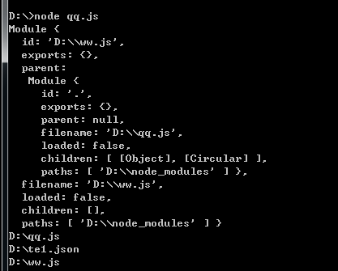

### js模块化
javsscript本身并不支持模块化，别的语言都有类包什么的，所以js要做大，就要有模块化。

最初封装模块是这样的
<pre>
var module = {
    var a = 1;
    var add = function(){
        ////
    }
}
</pre>
但是这样就暴露了所有的变量和方法，对变量的访问控制是不利的。于是就可以将变量进行私有化，使用立即执行函数(IIFE)
<pre>
var module = (function(){
    var a = 1;
    var geta = function(){
        return a;
    }
    var add = function(){
        ////
    }
    return {
        geta:geta,
        add:add
    }
})()
</pre>
### 放大模式
那如果想对module进行复用或者是继承怎么办，那就要把module给传进去。
<pre>
var module = (function(module){
    var a = 1;
    module.xx = xx
    var geta = function(){
        return a;
    }
    var add = function(){
        ////
    }
    return {
        geta:geta,
        add:add,
        ...module
    }
})(module)
</pre>
### 宽放大模式
<pre>
var module = (function(module){
    var a = 1;
    module.xx = xx
    var geta = function(){
        return a;
    }
    var add = function(){
        ////
    }
    return {
        geta:geta,
        add:add,
        ...module
    }
})(window.module || {})
</pre>

### commonjs和AMD
nodejs模块系统，是参照commonjs规范实现的。commonjs中，有一个全局的方法require()可以进行模块的加载。服务端做到了模块化，但是浏览器端还不行，因为服务端使用模块化的东西都是在本地硬盘上的，可以同步加载。而浏览器端不行，加载模块要依赖网络，可能会很慢，不能同步，那就只能用异步了。

### AMD规范(Asynchronous Module Definition)

语法 require([module], callback);
<pre>
require(['math'], function (math) {
　　　　math.add(2, 3);
　　});

require(['moduleA', 'moduleB', 'moduleC'], function (moduleA, moduleB, moduleC){
　　　　// some code here
　　});
</pre>

AMD模块定义，要用define()函数
<pre>
// math.js
　　define(function (){
　　　　var add = function (x,y){
　　　　　　return x+y;
　　　　};
　　　　return {
　　　　　　add: add
　　　　};
　　});
上面这种是匿名模块
define("constantModule",[],function(){  
     
    return {id:"hasName"};
     
});
上面这种是命名模块。
如果math还依赖其他模块，要这么写：
define(['myLib'], function(myLib){
　　　　function foo(){
　　　　　　myLib.doSomething();
　　　　}
　　　　return {
　　　　　　foo : foo
　　　　};
　　});

加载方法如下：
// main.js
　　require(['math'], function (math){
　　　　alert(math.add(1,1));
　　});
</pre>

### module对象
node内部有一个Module构建函数，所有模块都是Module的实例。
<pre>
function Module(id, parent) {
  this.id = id;
  this.exports = {};
  this.parent = parent;
  this.filename = null;
  this.loaded = false;
  this.children = [];
}

module.exports = Module;

var module = new Module(filename, parent);
</pre>
每个模块内部，都有一个module对象，代表当前模块。它有以下属性。
<pre>
module.id 模块的识别符，通常是带有绝对路径的模块文件名。
module.filename 模块的文件名，带有绝对路径。
module.loaded 返回一个布尔值，表示模块是否已经完成加载。
module.parent 返回一个对象，表示调用该模块的模块。
module.children 返回一个数组，表示该模块要用到的其他模块。
module.exports 表示模块对外输出的值。
</pre>
执行代码:
<pre>
var q = require('./ww')
Object.keys(require.cache).forEach(function(key) {
  console.log(key)
})

// ww.js
console.log(module)

//
</pre>

第一次加载某个模块时，Node会缓存该模块。以后再加载该模块，就直接从缓存取出该模块的module.exports属性。

关于require()解读
<http://www.ruanyifeng.com/blog/2015/05/require.html>

### import()
es6的动态导入
import()返回一个 Promise 对象。下面是一个例子。
<pre>
const main = document.querySelector('main');

import(`./section-modules/${someVariable}.js`)
  .then(module1 => {
      // module1在这里得到的是实际module里的exports对象，所以对于使用module.exports = xxx,那么module1就是xxx,如果是exports.xxx = xxx,那么module1就是{xxx:xxx},如果是export default,那么module1就是{default: xxx,__esModule:true}
    module1.loadPageInto(main);
  })
  .catch(err => {
    main.textContent = err.message;
  });
</pre>

